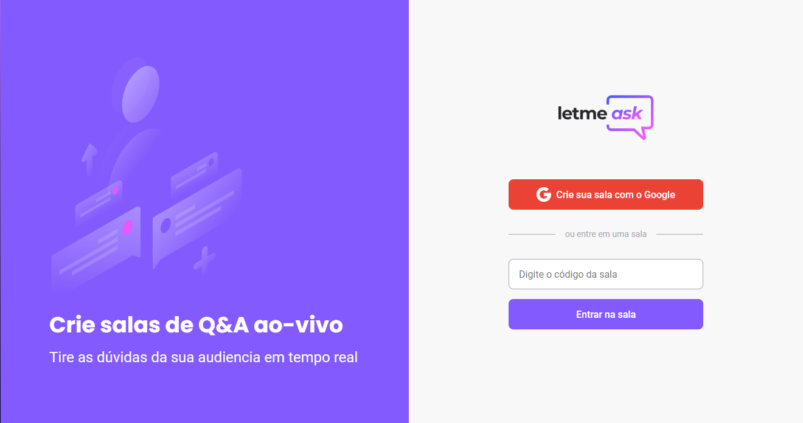

<div align="center">
  
</div>

## Letmeask

[](https://github.com/Klayverx)
[](#)

<h4 align="center">
  Letmeask is a platform built for Q&A.
</h4>



## 🧪 Technologies
<div align="center">
  <br />
  
</div>

This project was developed using the following technologies:

- [React](https://reactjs.org)
- [TypeScript](https://www.typescriptlang.org/)
- [Sass](https://sass-lang.com)
- [Firebase](https://firebase.google.com)


## 🚀 Getting started

### Requirements

- You need to install both [Node.js](https://nodejs.org/en/download/) and [Yarn](https://yarnpkg.com/) to run this project.

**Clone the project and access the folder**

```bash
$ git clone https://github.com/Klayverx/nlw06-letmeask.git && cd nlw06-letmeask
```

**Follow the steps below**
```bash
# Install the dependencies
$ yarn
# Run the web server
$ yarn start
```

The app will be available for access on your browser at `http://localhost:3000`

## 🔖 Layout

You can view the project layout through the links below:

- [Layout Web](https://www.figma.com/file/u0BQK8rCf2KgzcukdRRCWh/Letmeask/duplicate) 

Remembering that you need to have a [Figma](http://figma.com/) account to access it.
